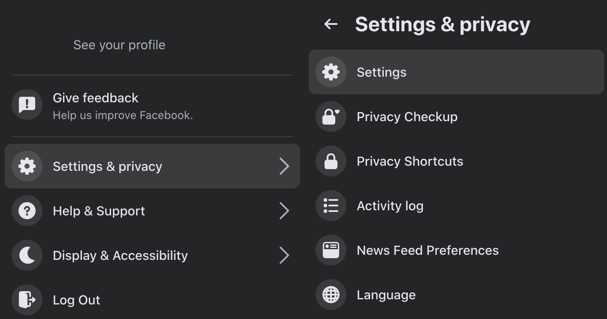
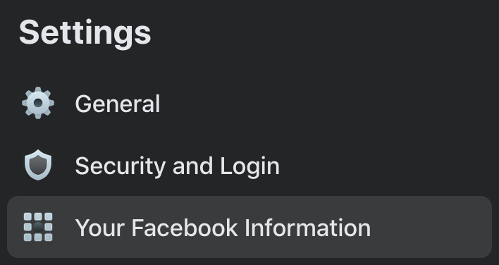
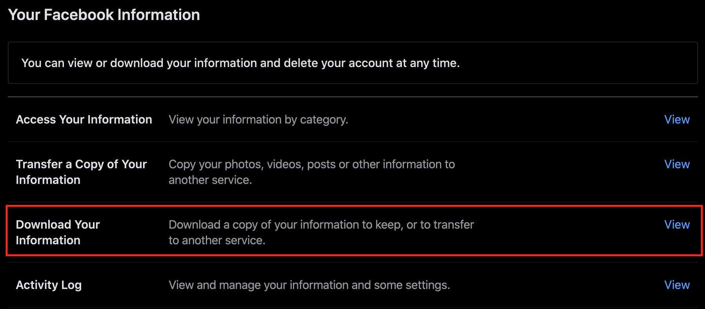
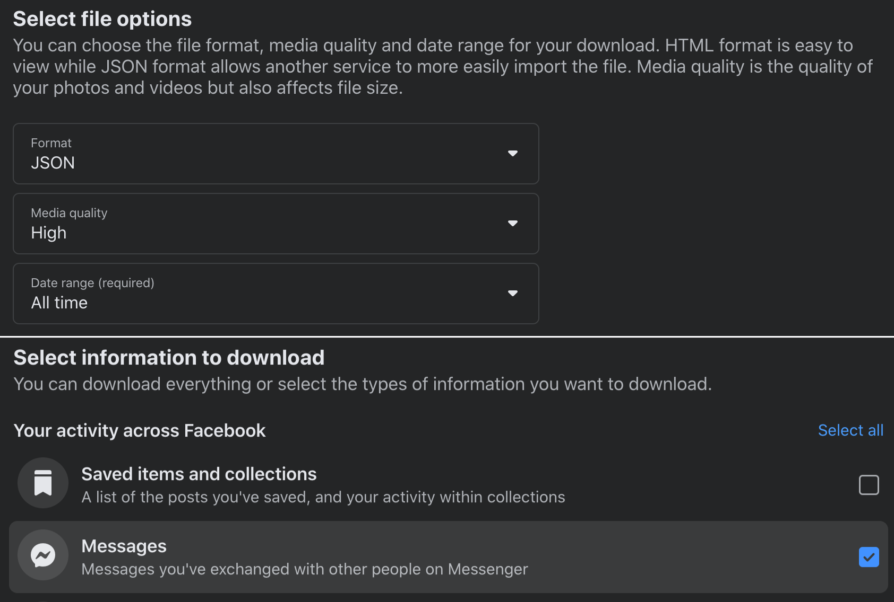

<div align="center">
  


<h1>Facebook Archive Photos Renamer</h1>
<h4>
Rename photos downloaded from Facebook archive to human-readable DateTime format.</h4>


<p align="center">
  <a href="#Preview">Preview</a> •
  <a href="#features">Features</a> •
  <a href="#how-it-works">How it works?</a> •
  <a href="#how-to-use">How to use?</a> •
  <a href="#license">License</a>
</p>
</div>

## Preview
| Before rename | After Rename |
|---|---|
|  |  

## Features
- Auto backup original photos before rename
- Auto deal with the duplicate file name by adding one second.

## How it works?

Loop through JSON file to get every message, if the message type is a photo, find that photo and rename it with the message timestamp.


## How to use?

### Download your data from Facebook

1. Go to `Settings & privacy` -> `Settings`



2. Choose `Your Facebook Information` -> `Download Your Information`




3. Under `Select file options`, choose `JSON` and `High`.
Under `Select information to download`, choose `Messages`.



4. Request a download


## License
```
Not decided yet.
```